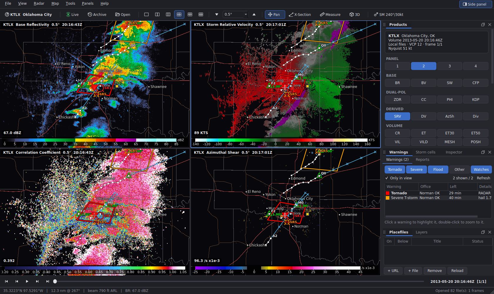
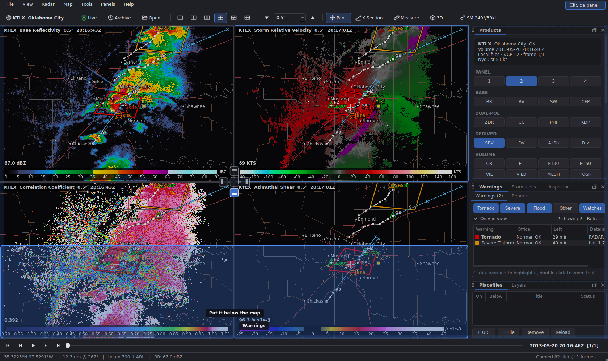
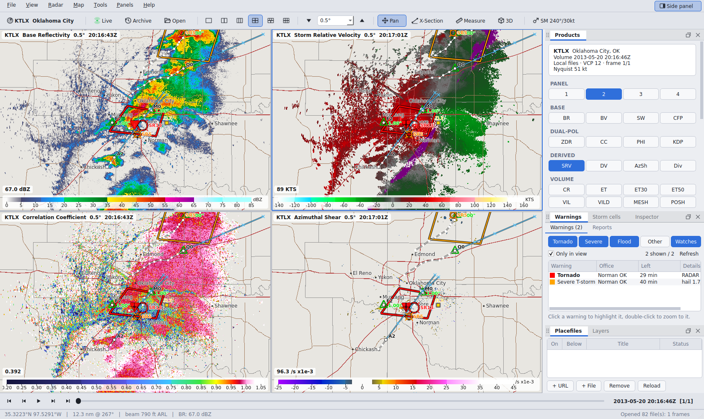
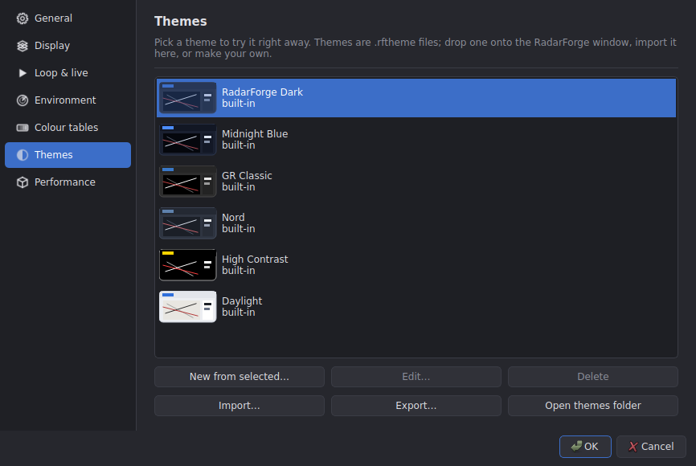

# RadarForge

A fast, GR2Analyst-style **NEXRAD weather radar viewer** for **Windows and Linux**.
Live and archived Level II / Level III data, 1–6 linked panels, derived products, GRLevelX
placefiles and colour tables, cross sections, a 3-D storm view, warnings, and themes.



**Contents:** [Features](#features) · [Requirements](#requirements) ·
[Install on Windows](#install-on-windows) · [Install on Linux](#install-on-linux) ·
[Running](#running) · [Updating & uninstalling](#updating--uninstalling) · [Using RadarForge](#using-radarforge) ·
[Troubleshooting](#troubleshooting) · [Development](#development) · [Changelog](CHANGELOG.md) · [License](#license)

---

## Features

* **Live data** straight from NOAA's NEXRAD feed on AWS – the newest volume draws in tilt by tilt
  while the radar is still scanning – plus Level III products.
* **Archive data** for any date back to 1991, or open files from your computer (drag & drop works).
* **1–6 linked panels**: pan, zoom and cursor move together; every panel shows its own product.
* **All the products**: reflectivity, velocity, spectrum width, dual-pol (ZDR, CC, PHI, KDP),
  storm-relative and dealiased velocity, azimuthal shear, divergence, composite reflectivity,
  echo tops, VIL, MESH/POSH, and the official Level III products (see [Products](#products)).
* **GRLevelX compatible**: your GR2Analyst `.pal` colour tables and placefiles work as they are.
  Drop a `.pal` onto a panel to use it; placefiles can be drawn above or below the radar data.
* **Warnings & storm reports** from the NWS (live) and the Iowa Environmental Mesonet (archive),
  with a warning list you can sort, filter and zoom to.
* **Storm cell table** (hail, mesocyclone rank, TVS), a **cursor inspector**, **cross sections** and a
  **3-D isosurface view** of any storm.
* **Movable panels with drop zones**: drag any tool panel to a new spot, stack panels as tabs, or float them.
* **Themes**: six built-in themes (including a light one and a GR-style classic), theme files you can
  share, and an editor to make your own.
* **Radar sites on the map**: click any radar to switch to it.

## Requirements

| | |
|---|---|
| **Operating system** | Windows 10 or 11 (64-bit), or Linux with X11 or Wayland (Fedora/Nobara, Ubuntu, Arch, …) |
| **Python** | 3.10 – 3.14, 64-bit (the installer downloads everything else) |
| **Graphics** | Any GPU with OpenGL 3.3 – NVIDIA, AMD and Intel all qualify. Keep the driver up to date. |
| **Disk / internet** | About 1 GB for the Python packages; an internet connection for live and archive data |

---

## Install on Windows

1. **Install Python** (skip if you already have 3.10 or newer):
   download it from **<https://www.python.org/downloads/>**, run the installer, tick
   **"Add python.exe to PATH"**, then click **Install Now**.
2. **Download RadarForge**: on this GitHub page click **Code → Download ZIP**, then right-click the
   ZIP → **Extract All…**. (Or `git clone` the repository.)
3. Open the extracted folder and **double-click `install.bat`**.
   It sets everything up (a few minutes the first time) and adds **RadarForge** to the Start Menu and
   the desktop.

   > If Windows shows "Windows protected your PC", click **More info → Run anyway** – the script is
   > plain text you can read first.

That's it – start **RadarForge** from the Start Menu or the desktop icon.

## Install on Linux

1. **Python 3.10+ and git** (most distributions already have Python):

   | Distribution | Command |
   |---|---|
   | Fedora / Nobara | `sudo dnf install python3 git` |
   | Ubuntu / Debian / Mint | `sudo apt install python3 python3-venv git` |
   | Arch / Manjaro | `sudo pacman -S python git` |

2. **Download and install** (in a terminal):

   ```bash
   git clone https://github.com/LibexiL/radarforge.git    # use this repository's URL
   cd radarforge
   bash install.sh
   ```

   (Or use **Code → Download ZIP**, extract it, open a terminal in the folder and run `bash install.sh`.)

The installer puts RadarForge in `~/.local/share/radarforge`, adds the `radarforge` command and an
app-menu entry with an icon.

---

## Running

| | Windows | Linux |
|---|---|---|
| **Normal start** | Start Menu or desktop → **RadarForge** | App menu → **RadarForge**, or run `radarforge` |
| **With a console window showing messages** | `%LOCALAPPDATA%\RadarForge\radarforge.bat` | run `radarforge` in a terminal |
| **Without installing** (straight from the folder) | double-click `run.bat` | `bash run.sh` |

The first start opens live data from **KTLX (Oklahoma City)**; after that it remembers your radar,
panels and layout. Click any radar square on the map (or **Ctrl+R**) to change radar.

### Command-line options

Add these after `radarforge` (Linux), `radarforge.bat` or `run.bat` (Windows):

| Option | What it does |
|---|---|
| `FILE …` | open Level II / Level III files |
| `--site KTLX` | start on this radar |
| `--layout 4` | start with 1–6 panels |
| `--no-live` | don't start live data on launch |
| `--safe-graphics` | plainest OpenGL setup (no antialiasing, no frame reuse) – for driver trouble |
| `--gl-reset` | forget the remembered graphics setup and detect it again (after a driver update) |
| `--x11` / `--software` | Linux only: force XWayland, or software rendering (slow) |

## Updating & uninstalling

**Update:** download the new version (or `git pull`) and run the installer again –
`install.bat` on Windows, `bash install.sh` on Linux. Your settings, themes and layout are kept.

**Uninstall:** run `uninstall.bat` (Windows) or `bash uninstall.sh` (Linux). It asks whether to
delete your settings and downloaded data too.

### Where things are stored

| | Windows | Linux |
|---|---|---|
| Program (installed) | `%LOCALAPPDATA%\RadarForge\venv` | `~/.local/share/radarforge` |
| Settings, themes, colour tables | `%APPDATA%\RadarForge` | `~/.config/radarforge` |
| Downloaded radar data | `%LOCALAPPDATA%\RadarForge\cache` | `~/.cache/radarforge` |
| Log file | `%LOCALAPPDATA%\RadarForge\cache\radarforge.log` | `~/.cache/radarforge/radarforge.log` |

---

## Using RadarForge

### Basics

| Action | How |
|---|---|
| Pan / zoom / centre | drag · mouse wheel · double-click |
| Change a panel's product or colour table | right-click the panel, or use **Products** in the side panel |
| Switch radar | click a radar square on the map, the radar button (top left), or **Ctrl+R** |
| Live / archive / files | **Live**, **Archive** and **Open** on the toolbar |
| Frames and loop | **← / →**, **Space** to play, **End** for the latest – or the timeline bar at the bottom |
| Tilts | **↑ / ↓** or the tilt box |
| Number of panels | toolbar layout buttons, or **Alt+1 … Alt+6** |
| Cross section | **X**, then drag a line across a storm |
| Distance / bearing | **M**, then drag (or Shift-drag at any time) |
| 3-D view | **B** (or **3D**), then drag a box around a storm. In the 3-D view: drag to rotate, right-drag to pan, wheel to zoom |
| Colour table | drag a `.pal` file onto a panel |
| Storm motion (for SRV) | click **SM …** on the toolbar – it can use the average motion of the tracked storms |
| Placefiles | side panel → **Placefiles** (or **Ctrl+P**): add a URL or file; **On** shows it, **Below** draws it under the radar |
| Side panel | **F9** or **Side panel** (top right) |
| Save a picture | **Ctrl+S** |
| All shortcuts | **F1** |

### Side panel

| Tab | What it does |
|---|---|
| **Products** | radar and volume info, which panel you're changing, product and tilt buttons, colour table and storm motion |
| **Warnings** | active warnings for the time shown (tornado / severe / flood / other / watches), time left and tags such as RADAR CONFIRMED. Click to highlight, double-click to zoom. **Reports** lists storm reports |
| **Storm cells** | Level III cells sorted by threat: position, motion, hail probability and size, mesocyclone rank, TVS. Double-click to centre on a cell |
| **Inspector** | the value of every panel under the mouse, plus pop-up text for anything there |
| **Placefiles** | the placefile manager |
| **Layers** | overlays, map layers, smoothing and the velocity noise filter |

### Moving panels

Drag a panel by its **tab**. Every place it can go is outlined, and a blue preview shows where it will land:

| Drop on… | Result |
|---|---|
| the top / bottom / left / right part of a panel | splits that panel and puts this one on that side |
| the middle of a panel | adds it there as another tab |
| the outer part of the map | docks it beside the map (e.g. a cross section under the map) |
| the very edge of the window | docks it along that whole edge |
| the middle of the map, or outside the window | floats it as its own window |

**Esc** cancels a drag. The dotted grip at the left of a tab bar moves the whole group.
Each tab bar has a pop-out / dock-back button and a close button. Drag the dividers to resize.
**Panels → Lock panel layout** prevents accidental moves; **Panels → Reset panel layout** restores the default.



### Themes

**View → Theme** switches theme. **Settings → Themes** shows previews and lets you make a new theme
from any other (every interface and map colour and line width, with a live preview), import and
export theme files, or delete your own. Dropping a `.rftheme` file onto the window imports and applies it.

<p>
  
  
</p>

Theme files are small JSON files. Anything left out comes from the default theme; colours are
`#rrggbb` or `#rrggbbaa` (the last two digits are transparency):

```json
{
  "format": "radarforge-theme", "version": 1,
  "name": "Storm Night", "dark": true,
  "ui":  {"window": "#1b1d24", "accent": "#e0662b"},
  "map": {"map_bg": "#000000", "states": "#ffffff", "counties": "#8080809a", "roads": "#d24b4b"},
  "widths": {"states": 2.0, "counties": 1.0}
}
```

A complete example is [docs/example.rftheme](docs/example.rftheme).

### Settings

**File → Settings** (**Ctrl+,**) has: General (units, start-up, mouse), Display (smoothing, velocity
noise filter, colour bars), Loop & live, Environment (0 °C / −20 °C heights for MESH/POSH),
Colour tables, Themes and Performance (memory, graphics info, log file).

### Products

| Group | Products |
|---|---|
| Base (Level II) | Reflectivity, Velocity, Spectrum Width, Clutter Filter Power Removed |
| Dual-pol (Level II) | ZDR, Correlation Coefficient, Differential Phase, KDP |
| Derived, per tilt | Storm-Relative Velocity, Dealiased Velocity, Azimuthal Shear (rotation), Radial Divergence |
| Volume | Composite Reflectivity, Echo Tops 18/30/50 dBZ, VIL, VIL Density, MESH, POSH |
| Level III, per tilt | Super-res Reflectivity, Velocity, Storm-Relative Velocity, CC, ZDR, KDP, Hydrometeor Class |
| Level III | Digital VIL, Enhanced Echo Tops, Hybrid Hydroclass, Precip Rate, 1-h / 3-h / Storm-Total precip |
| Level III overlays | Storm tracks, Mesocyclones, TVS, Hail, Melting layer |

SAILS / MESO-SAILS repeats of the 0.5° cut are grouped under that tilt (shown as "0.5° ×2").

### How live mode works

The last few complete volumes come from the Level II archive; the volume being scanned right now is
fetched in chunks as the radar produces them (every 15 s by default), so the newest tilts appear
within seconds. Tilts the new volume hasn't reached yet show the previous volume ("prev vol" in the
panel title). Level III products are checked once a minute.

---

## Troubleshooting

| Problem | Fix |
|---|---|
| **"Python was not found"** during install (Windows) | Install Python from python.org and tick **"Add python.exe to PATH"**, then run `install.bat` again. |
| **Black map, frozen window or garbled picture** | Update the graphics driver. RadarForge tests several OpenGL setups by itself and remembers the one that works; `--gl-reset` makes it test again, `--safe-graphics` uses the plainest setup. |
| **Everything is slow** | **Settings → Performance** shows the OpenGL renderer. *llvmpipe* or *Software* means the GPU driver isn't being used – update it, then start once with `--gl-reset`. |
| **A panel is gone / messy layout** | **Panels** menu to show it again, or **Panels → Reset panel layout**. |
| **Dashed coloured circles that look like range rings** | That's the Level III melting layer (**Map → Melting layer**). Real range rings are grey and labelled. |
| **Live data or downloads fail** | Check your internet connection / firewall – RadarForge reads from `unidata-nexrad-level2.s3.amazonaws.com`. Archive files already downloaded and local files still work offline. |
| **Anything else** | Look at the log file (see [Where things are stored](#where-things-are-stored)) or start RadarForge with a console window (see [Running](#running)). If the window ever stops responding for 10 s, the log also records what the program was doing. |

---

## Development

```bash
python -m venv .venv && . .venv/bin/activate          # Windows: .venv\Scripts\activate
pip install -e ".[dev]"
python -m radarforge                                   # run from the source
python -m pytest -q tests                              # tests (no network or GPU needed)
python -m pyflakes radarforge tests                    # lint
```

`RADARFORGE_TEST_L2=/path/to/KTLX20130520_201643_V06.gz python -m pytest tests` adds a full Level II
decode + product test. The basemap is rebuilt with `tools/build_maps.py` (needs `pip install -e ".[maps]"`).
Tests run automatically on Windows and Linux for every push (`.github/workflows/tests.yml`).

### Project layout

```
radarforge/
├── install.bat · run.bat · uninstall.bat      Windows scripts
├── install.sh  · run.sh  · uninstall.sh       Linux scripts
├── radarforge/                                the application (Python package)
│   ├── app.py            start-up, OpenGL detection, logging
│   ├── config.py         settings and per-OS folders
│   ├── themes.py         themes and theme files
│   ├── gl_setup.py       OpenGL setups to try
│   ├── data/             Level II decoder, Level III (MetPy), AWS access, live chunks, radar sites
│   ├── products/         product catalog, colour tables, dealiasing, derived & volume products
│   ├── render/           OpenGL radar view, shaders, basemap
│   ├── features/         placefiles, warnings, Level III overlays
│   ├── tools/            cross section, 3-D view
│   ├── ui/               main window, panels, workspace (docking), dialogs, settings, icons
│   └── assets/           basemap, icons
├── scripts/              helpers used by the installers
├── tests/                automated tests
├── tools/                developer tools (basemap builder)
├── docs/                 screenshots, example theme
├── CHANGELOG.md · LICENSE · THIRD_PARTY_NOTICES.md
└── pyproject.toml · requirements.txt
```

### Notes and limits

* The derived products (dealiasing, KDP, azimuthal shear, MESH) are RadarForge's own implementations
  of published methods – good for interrogation, but not the NWS algorithms. The Level III versions
  are the official ones.
* MESH/POSH use the 0 °C and −20 °C heights from Settings.
* Watches are shown in live mode; archive mode shows storm-based warnings and storm reports.

## Credits

Radar data: NOAA NEXRAD on AWS (Unidata). Warnings: National Weather Service API and the Iowa
Environmental Mesonet. Level III decoding: MetPy. Map data: US Census Bureau, Natural Earth, GeoNames.
Radar site list derived from Supercell Wx. Details and licences: [THIRD_PARTY_NOTICES.md](THIRD_PARTY_NOTICES.md).

## License

RadarForge is released under the [MIT License](LICENSE). Data sources and bundled third-party data
keep their own terms – see [THIRD_PARTY_NOTICES.md](THIRD_PARTY_NOTICES.md).
